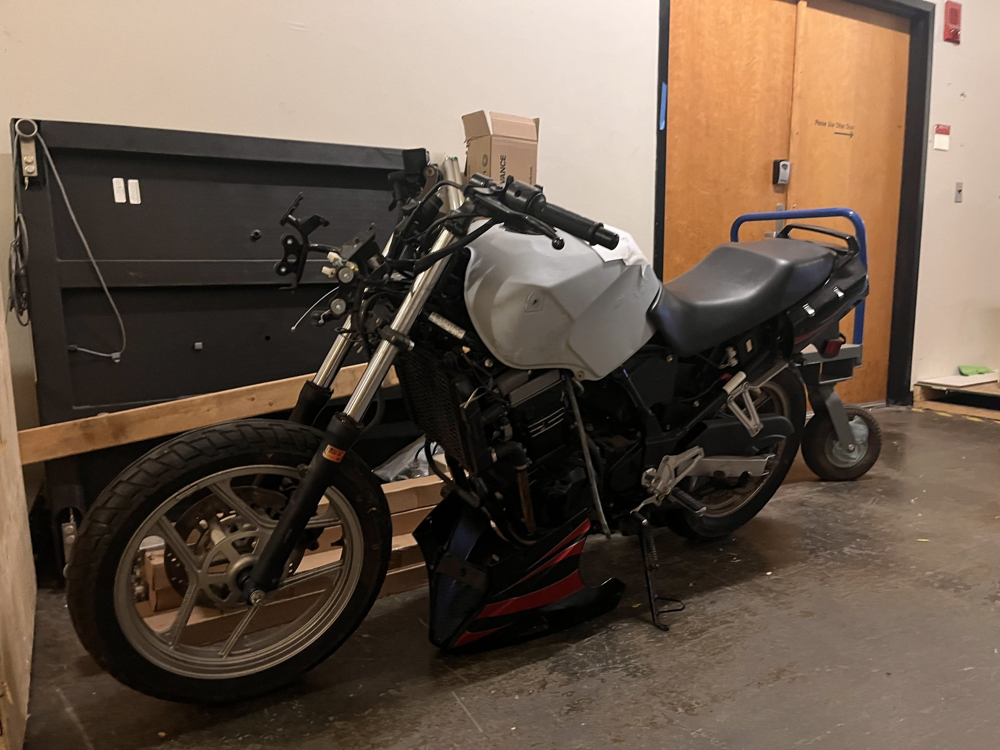
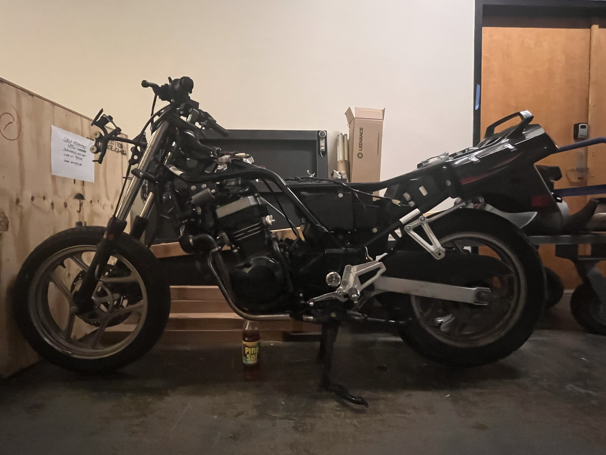
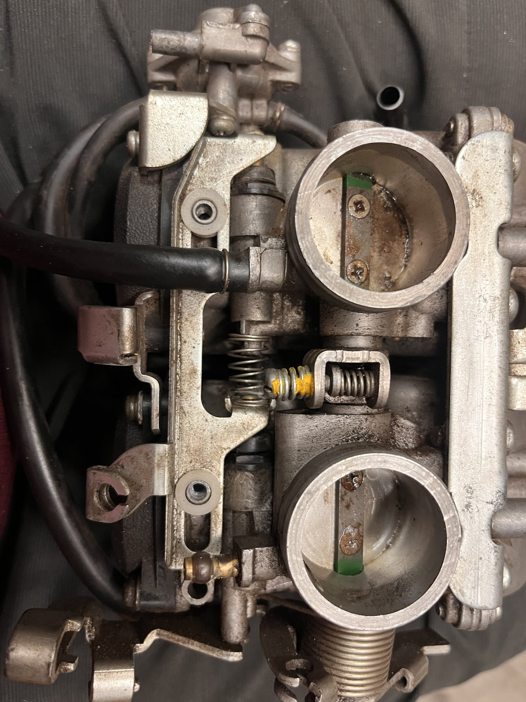
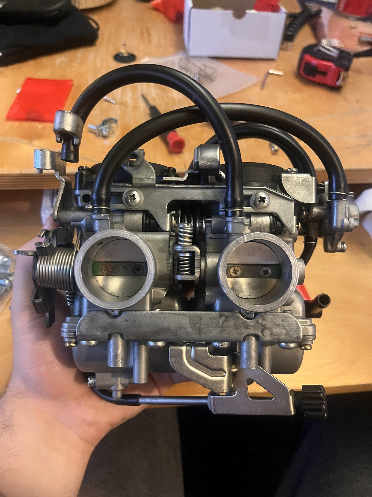
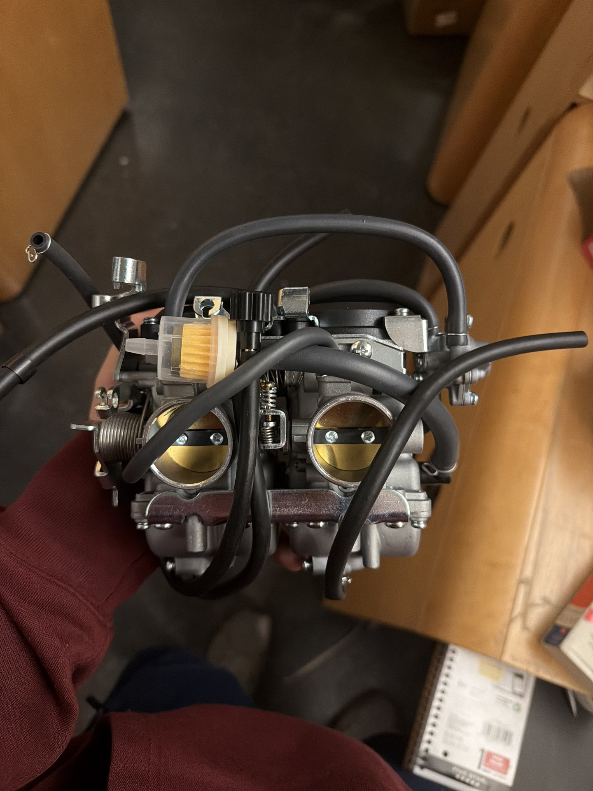

# 2007 Kawasaki Ninja 250 Restoration & Modernization



Restoring a 2007 Kawasaki Ninja 250 from a parts bike back to reliable
running condition, while modernizing some of the electronics and exploring
custom bodywork along the way.

## Project Goals

- Restore the motorcycle to full mechanical functionality
- Replace aging analog electronics with modern digital sensors and displays
  to improve tuning capabilities
- Design and fabricate custom components, including fairings and an airbox
- Evaluate aerodynamic improvements through custom bodywork design

## Progress

### ✅ Completed
- Full motorcycle teardown and inspection
- Engine fluid replacement and baseline maintenance
- Disassembly, cleaning, and rebuild of dual carburetors
- Documentation of existing throttle linkage and intake geometry

### 🔧 In Progress
- Replacement carburetor installation and tuning
- Planning upgrades to electronic instrumentation and sensor systems
  (priorities: odometer, gear selector, speedometer)

---

## Build Log

### Teardown
Full teardown to bare frame for inspection before any rebuild work started.



### Carburetor Rebuild
The original dual carburetors were pulled, cleaned, and inspected. A
replacement unit is now being installed and tuned in their place.

| As removed | Cleaned (bore detail) | Replacement, installed |
|:---:|:---:|:---:|
|  |  |  |

### Videos
Short clips from the bench and first start-up.

| Clip | Description |
|---|---|
| [▶ Fuel / gas setup](media/videos/gas-setup.mp4) | Fuel line and petcock setup ahead of first start |
| [▶ First start](media/videos/first-start.mp4) | Engine's first start after the carb work |
| [▶ Kill switch test](media/videos/switch-start.mp4) | Confirming the kill switch cuts ignition properly |

> **Note on video playback:** GitHub doesn't play `.mp4` files inline just
> because they're linked from the repo — the links above will open/download
> the raw file. To get a real inline player (like the ones you see in other
> project READMEs), open this file in the GitHub web editor and drag each
> video directly into the text box. GitHub uploads it to their own CDN and
> inserts a `github.com/user-attachments/assets/...` link, which *does*
> render as a playable video. Swap the links above for those once you've done
> that for each clip.

---

## Documentation
Factory/aftermarket reference material lives in [`docs/`](docs/).

## Software
Code for a spark-amplifier-based RPM readout (a step toward the digital
tach/speedo goal) lives in [`software/rpm-monitor/`](software/rpm-monitor/).
Circuit diagram coming soon.

## Tools & Methods
- Mechanical disassembly and inspection
- Carburetor rebuilding and tuning
- Hand tools and mechanical measurement
- Electrical system documentation

---

## Repository Structure

```
.
├── README.md
├── docs/                  # service manual, reference PDFs
├── media/
│   ├── images/            # build photos
│   └── videos/            # short clips (see note above on embedding)
└── software/
    └── rpm-monitor/        # spark-amp RPM tap: code + circuit diagram
```
